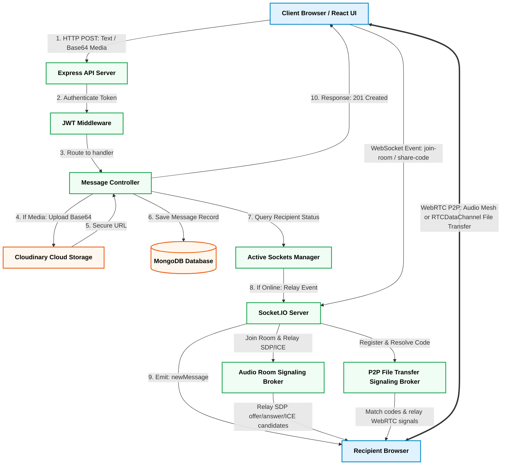

<div align="center">

# Chatly — Not just a chatting application

**A state-of-the-art, full-stack real-time messaging platform, P2P file sharing utility, and live drop-in audio suite built with React, Node.js, Socket.IO, and P2P WebRTC — with zero external audio SDK dependencies.**


</div>

---

## Core Features

### 1. Real-Time Direct Messaging
* **Instant Delivery**: 1-on-1 text messaging with ultra-low latency powered by Socket.IO client-server synchronization.
* **Presence & Activity Tracking**: Real-time online status indicators, active typing states, and automatic unread notification badge counters.
* **Rich Attachments**: Seamless integration with Base64 encoding and Cloudinary storage for instant image sharing in chat threads.

### 2. Dedicated Live Audio Rooms
* **Drop-In Mesh Channels**: Virtual audio rooms (similar to Clubhouse or Discord channels) using decentralized peer-to-peer WebRTC audio streams with direct, shareable invitation links (`/room/:roomId`).
* **Active Speaker Detection**: Implements a browser-native `AudioContext` and `AnalyserNode` frequency spectrum visualizer that detects active speakers and outlines them with a pulsing glow ring.
* **Host Controls**: Authoritative room tools allowing hosts to mute all participants, toggle room locks, customize room titles, or terminate sessions for everyone.
* **Guest Access Support**: Simplifies access for unauthenticated link-recipients via instant temporary display name configuration.

### 3. High-Performance Peer-to-Peer File Transfer
* **Direct WebRTC DataChannel sharing**: Enables secure, high-bandwidth P2P transfers directly between browsers without intermediate server bandwidth consumption or storage logs.
* **6-Digit Sharing Codes**: Users can generate temporary 6-digit access codes to safely pair sender and receiver endpoints over the signaling server.
* **Flow-Controlled Chunking**: Splits larger payloads into sequential 64KB blocks, pausing when the output buffer exceeds 256KB to prevent memory exhaustion and browser slowdowns.
* **Data Integrity Checks**: Computes and compares CRC32 checksums for every block to ensure that files are assembled correctly without corruption.
* **Connection Reconnection Engine**: Monitors WebRTC state drops and implements automatic reconnection handshakes, resuming transfers from the last acknowledged chunk index.

### 4. In-Chat Voice Notes
* **Native MediaRecorder Integration**: Lightweight recording interface inside chat feeds including a live duration counter, visual recording pulse, and direct trash discard options.
* **Custom Waveform Player**: Decodes and displays audio notes as an interactive visual soundwave player with custom speed multipliers (1x, 1.5x, 2x), scrubbable timelines, and dynamic progress tracking.

### 5. Sleek Dark & Light Themes
* **Retro-Modern Styling**: Consistent retro-themed borders, clean typography, HSL color schemes, and seamless dark-light mode transition with persistent local state.

---

## System Architecture

```text
┌─────────────────────────────────────────────────────────────────────────────┐
│                              CLIENT (React 18)                              │
│                                                                             │
│  ┌──────────────────────┐  ┌──────────────────────┐  ┌───────────────────┐  │
│  │   Pages & Dashboards │  │      Components      │  │   Zustand Stores  │  │
│  │  HomePage (Chats)    │  │ MessageInput (Mic)   │  │ useAuthStore      │  │
│  │  AudioRoomsDashboard │  │ AudioMessageBubble   │  │ useChatStore      │  │
│  │  AudioRoomPage (P2P) │  │ HostSettingsModal    │  │ useThemeStore     │  │
│  │  P2PTestPage (Files) │  │ FileTransferModal    │  │ useFileTransfer   │  │
│  └──────────────────────┘  └──────────────────────┘  └───────────────────┘  │
│                             │                  │                            │
│                  HTTP (Axios REST)        WebSocket & WebRTC                │
└─────────────────────────────┼──────────────────┼────────────────────────────┘
                              │                  │
┌─────────────────────────────┼──────────────────┼────────────────────────────┐
│                             ▼                  ▼                            │
│                      SERVER (Node.js + Express + Socket.IO)                 │
│                                                                             │
│  ┌──────────────────────┐  ┌──────────────────────┐  ┌───────────────────┐  │
│  │     REST API Routes  │  │   Signaling Broker   │  │   Cloud Storage   │  │
│  │ /api/auth            │  │ join-room, offer     │  │ Cloudinary        │  │
│  │ /api/messages        │  │ answer, ice-candidate│  │ (Image & Audio)   │  │
│  └──────────┬───────────┘  └──────────┬───────────┘  └───────────────────┘  │
└─────────────┼─────────────────────────┼─────────────────────────────────────┘
              ▼                         ▼
    ┌──────────────────┐      ┌─────────────────────────┐
    │  MongoDB Database│      │ WebRTC P2P Media Mesh   │
    │  (Users/Messages)│      │  [Peer A] ◄═══► [Peer B]│
    └──────────────────┘      └─────────────────────────┘
```

---

## Backend Request and Signaling Flows

The backend acts as both an HTTP REST API server and a real-time signaling coordinator. The diagram below illustrates how message requests, storage, media handling, and WebRTC handshakes are routed through the system.



---

## Technical Deep Dive: WebSockets & WebRTC

This application is built entirely on two fundamental real-time browser technologies: **WebSockets** and **WebRTC**. Understanding how they interact is key to understanding the codebase.

### 1. WebSockets via Socket.IO
WebSockets provide a persistent, bidirectional, full-duplex communication channel over a single TCP connection. In Chatly, we utilize **Socket.IO** to manage this connection.

#### How It Works
* **The Handshake**: The connection starts as a standard HTTP request. The client requests a connection upgrade (`Upgrade: websocket`). Once approved, the underlying socket remains open.
* **Persistent Event Exchange**: Rather than repeatedly rebuilding connections, the client and server emit and listen to custom JSON events with negligible overhead.

#### Chatly Implementations
* **Direct Messaging**: When User A sends a message, it is emitted via a socket connection, written to MongoDB on the server, and immediately relayed to User B's active socket room.
* **Online Presence and Typing Indicators**: Sockets maintain a heartbeat. If a user closes their tab, the server detects the socket disconnect and broadcasts an offline state to all contacts. Typing states emit light payloads (`typing` and `stop-typing`) to update chat UI in real-time.
* **WebRTC Signaling**: WebRTC cannot establish a connection on its own; it needs an intermediary channel to exchange network configuration and media details. Socket.IO acts as this **Signaling Broker**.

---

### 2. WebRTC (Web Real-Time Communication)
WebRTC is an open-source standard that enables web browsers and mobile applications to exchange real-time media (audio/video) and arbitrary data directly peer-to-peer (P2P) without routing traffic through a media server.

#### The Signaling Workflow
Before two peers can connect directly, they must perform a handshake via the WebSocket signaling server:
1. **SDP Exchange**: Senders create an Session Description Protocol (SDP) **Offer** describing their media formats, codecs, and connection capabilities. This is sent through Socket.IO to the receiver. The receiver returns an SDP **Answer**.
2. **ICE Candidates**: Peers gather candidate network paths (IP addresses, ports, and protocols) using STUN (Session Traversal Utilities for NAT) servers. These **ICE (Interactive Connectivity Establishment) Candidates** are exchanged via the WebSocket connection.
3. **P2P Binding**: Once candidates are matched, the peers test direct network routes. Once verified, the connection transitions from the WebSocket server directly to a secure peer-to-peer UDP link.

```text
   [Peer A (Host)]               [Socket.IO Server]               [Peer B (Joiner)]
          │                              │                                │
          │──── 1. emit("create-room") ─►│                                │
          │                              │◄─── 2. emit("join-room") ──────│
          │◄── 3. emit("user-connected")─│                                │
          │                              │                                │
          │──── 4. createOffer() ───────►│                                │
          │     emit("offer")            │──── 5. relay offer ───────────►│
          │                              │                                │
          │                              │◄─── 6. createAnswer() ─────────│
          │◄── 7. relay answer ──────────│     emit("answer")             │
          │                              │                                │
          │──── 8. ICE Candidate (STUN)─►│                                │
          │     emit("ice-candidate")    │──── 9. relay ICE candidate ───►│
          │                              │                                │
          └═══════════════════════════════════════════════════════════════┘
                       DIRECT PEER-TO-PEER ENCRYPTED LINK
                         (Audio streams & Data channels)
```

---

### 3. Feature Implementations

#### WebRTC Mesh Audio Rooms
Unlike a centralized system where everyone uploads audio streams to a server (Selective Forwarding Unit / SFU), Chatly uses a **Peer-to-Peer Mesh Architecture**.
* When a participant joins an audio room, they establish a separate `RTCPeerConnection` with *every other participant* in the room.
* **Audio Interception**: Local microphone access is acquired using `navigator.mediaDevices.getUserMedia()`. Track streams are appended directly to each active connection.
* **Speaker Visualizer**: The browser's native Web Audio API captures raw audio tracks. An `AudioContext` routes the signal through an `AnalyserNode`. Using `getByteFrequencyData`, the UI measures volume amplitude in real-time, displaying a glowing ring wrapper around active speakers without requiring external SDKs.

#### P2P File Sharing (DataChannels)
For direct file transfers, Chatly opens an `RTCDataChannel` on top of the established `RTCPeerConnection`. This bypasses HTTP uploads and relays files directly between users.
* **Binary File Chunking**: Browsers cannot send files in a single packet. The file is split into 64KB `ArrayBuffer` chunks using the browser `File.slice()` API.
* **Flow Control and Buffer Management**: WebRTC data channels can choke if files are pushed faster than the network can transmit them. The sender monitors `webRTC.channel.bufferedAmount`. If it exceeds 256KB, transmission pauses, resuming only when the browser fires the `onbufferedamountlow` event.
* **Integrity and Recovery**: Each chunk is prefixed with metadata containing the block index, total counts, and a CRC32 checksum. The receiver validates each block's checksum against corruptions. If a network interruption occurs, the client falls back to WebSockets signaling to pause, reconnect, and resume from the last acknowledged index.

---

## Directory Structure

```text
fullstack-chat-app/
├── backend/
│   ├── src/
│   │   ├── controllers/    # Auth, messaging, and API logic
│   │   ├── lib/            # DB configuration, Cloudinary, and Socket.IO servers
│   │   ├── middleware/     # JWT authentication middleware
│   │   ├── models/         # Mongoose User and Message schemas
│   │   ├── routes/         # Express REST API endpoints
│   │   └── index.js        # Server entry point and Socket.IO event registrations
│   └── package.json
│
└── frontend/
    ├── src/
    │   ├── components/     # FileTransferModal, NetworkTransferCanvas, AudioMessageBubble, etc.
    │   ├── pages/          # HomePage, AudioRoomsDashboardPage, AudioRoomPage, P2PTestPage
    │   ├── store/          # Zustand state stores (auth, chat, theme)
    │   ├── hooks/          # useFileTransfer, useDataChannel (WebRTC core engines)
    │   ├── utils/          # chunkFile, speedCalculator, fileValidators, etaCalculator
    │   ├── App.jsx         # React application router and layouts
    │   └── main.jsx        # React DOM entry point
    └── package.json
```

---

## Quick Start & Installation

### Prerequisites
* Node.js (v18 or higher)
* MongoDB Database (Local instance or MongoDB Atlas cluster)
* Cloudinary Account (for image & audio attachment storage)

### 1. Clone the Repository
```bash
git clone https://github.com/RohitChintalapudi/Chatly.git
cd Chatly
```

### 2. Backend Setup
```bash
cd backend
npm install
```

Create a `.env` file inside the `backend` directory:
```env
PORT=5001
MONGODB_URI=your_mongodb_connection_string
JWT_SECRET=your_jwt_secret_key
NODE_ENV=development

CLOUDINARY_CLOUD_NAME=your_cloudinary_cloud_name
CLOUDINARY_API_KEY=your_cloudinary_api_key
CLOUDINARY_API_SECRET=your_cloudinary_api_secret
```

Start the backend server in development mode:
```bash
npm run dev
```

### 3. Frontend Setup
Open a new terminal window:
```bash
cd frontend
npm install
npm run dev
```

Open **[http://localhost:5173](http://localhost:5173)** in your browser!

---

## WebSocket Signaling Event Reference

| Event Name | Direction | Payload | Description |
|---|---|---|---|
| `join-room` | Client ➔ Server | `{ roomId, user }` | Enters a live audio room session |
| `room-users` | Server ➔ Client | `{ roomId, title, hostId, users }` | Retrieves list of active participants in a room |
| `user-connected` | Server ➔ Broadcast | `{ socketId, userId, name, avatar }` | Notifies active peers of a new participant |
| `offer` | Client ⇄ Client | `{ targetSocketId, offer }` | Relays WebRTC SDP Offer connection details |
| `answer` | Client ⇄ Client | `{ targetSocketId, answer }` | Relays WebRTC SDP Answer connection details |
| `ice-candidate` | Client ⇄ Client | `{ targetSocketId, candidate }` | Disseminates STUN network routing candidates |
| `toggle-mute` | Client ➔ Server | `{ roomId, isMuted }` | Updates microphone mute states for participants |
| `host-mute-all` | Host ➔ Room | `{ roomId }` | Force-mutes all non-host participants |
| `host-toggle-lock`| Host ➔ Room | `{ roomId, isLocked }` | Blocks new participants from entering |
| `host-end-room` | Host ➔ Room | `{ roomId }` | Closes and terminates a live audio session |
| `register-share-code` | Client ➔ Server | `{ code, transferId, metadata, senderName }` | Binds a 6-digit code to an active file share session |
| `resolve-share-code` | Client ➔ Server | `{ code, receiverName, receiverAvatar }` | Looks up and matches a 6-digit file transfer code |
| `share-code-matched` | Server ➔ Sender | `{ receiverId, receiverName, receiverAvatar }` | Alerts the sender that a recipient resolved their code |
| `share-code-resolved`| Server ➔ Receiver | `{ senderId, senderName, senderAvatar, transferId, metadata }` | Resolves session parameters to initiate WebRTC handshake |

---

## License

This project is licensed under the **MIT License** — see the [LICENSE](LICENSE) file for details.

Copyright (c) 2026 **Rohit Chintalapudi**

---

<div align="center">

**Built with passion by [Rohit Chintalapudi](https://github.com/RohitChintalapudi)**

</div>
